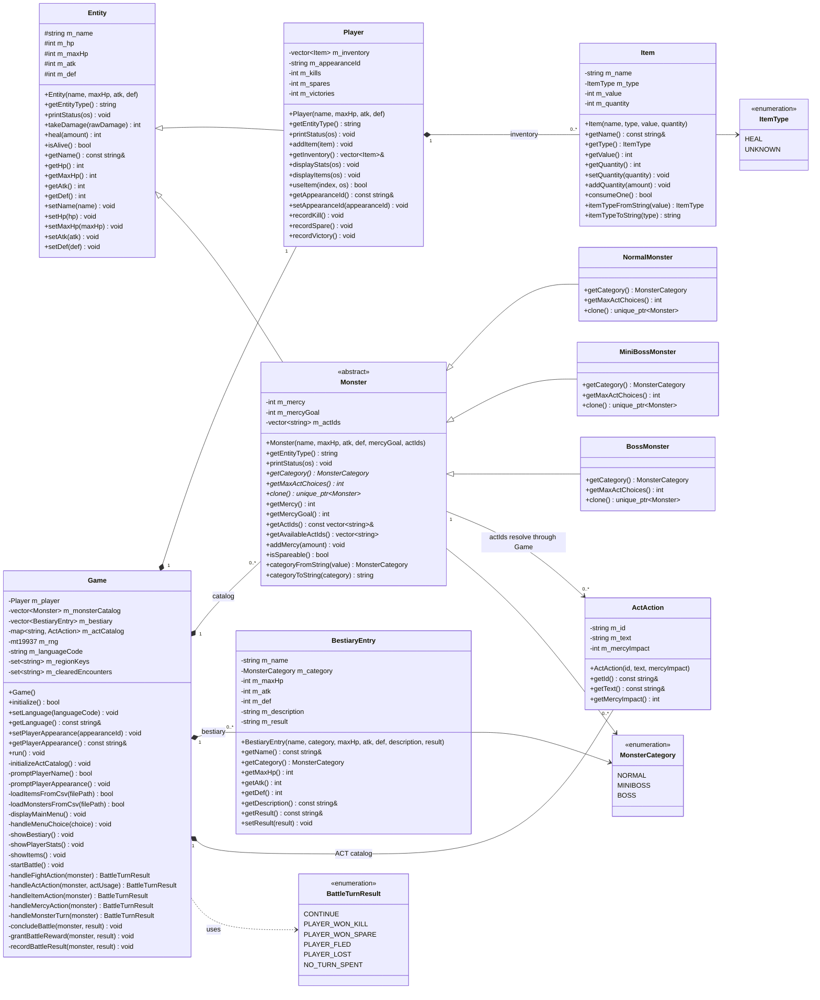
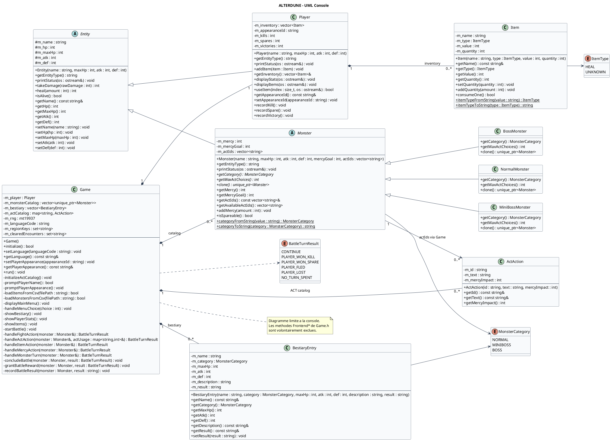

# ALTERDUNE - UML Console

## Perimetre

Ce document decrit le modele UML de la partie console d'ALTERDUNE.

Le frontend SFML n'est pas represente ici, meme si certaines methodes `Frontend*` existent dans `Game.h`. Le diagramme ci-dessous se concentre sur le moteur console compile dans `alterdune_console` :

- `src/main.cpp`
- `include/Entity.h` / `src/Entity.cpp`
- `include/Player.h` / `src/Player.cpp`
- `include/Monster.h` / `src/Monster.cpp`
- `include/Item.h` / `src/Item.cpp`
- `include/ActAction.h` / `src/ActAction.cpp`
- `include/BestiaryEntry.h` / `src/BestiaryEntry.cpp`
- `include/Game.h` / `src/Game.cpp`

## Diagramme UML

## Script PlantUML

Copier-coller ce script dans un editeur PlantUML en ligne, par exemple PlantUML Online Server ou PlantText.

## Lecture rapide

- `Entity` factorise les attributs et comportements communs aux combattants.
- `Player` herite de `Entity` et possede un inventaire de `Item`.
- `Monster` herite de `Entity`, reste abstraite, gere la mercy et expose `clone()` pour creer des combats a partir du catalogue.
- `NormalMonster`, `MiniBossMonster` et `BossMonster` specialisent le nombre d'actions ACT disponibles.
- `Game` orchestre la boucle console, le chargement CSV, le catalogue ACT, le catalogue de monstres, les combats, les recompenses et le bestiaire.
- `Monster` ne contient pas directement des `ActAction` : il stocke des identifiants (`m_actIds`) resolus dans `Game::m_actCatalog`.
